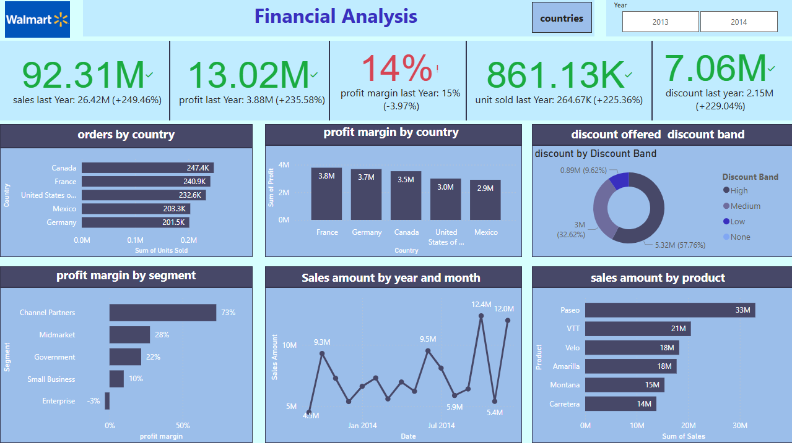
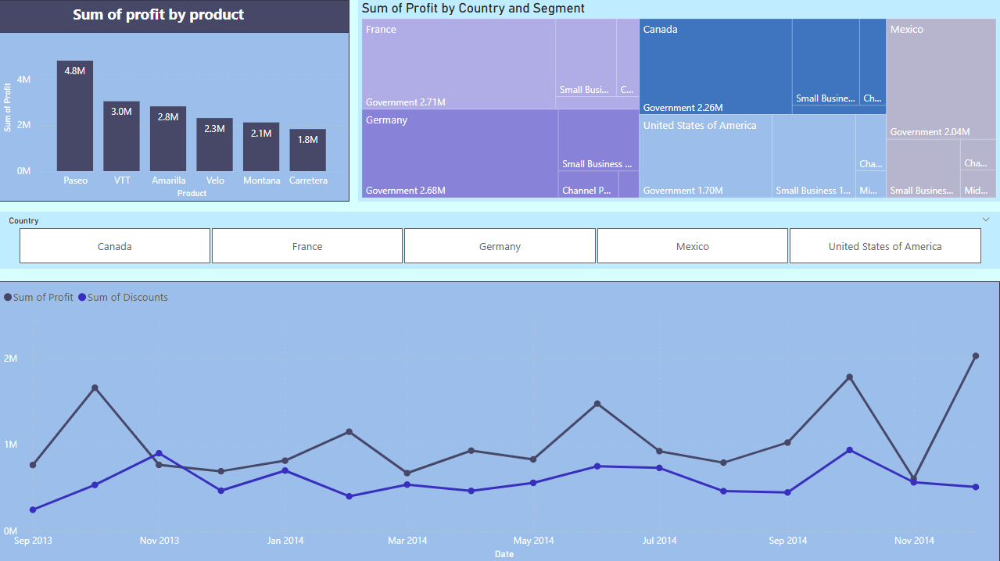

# Financial Analysis Report

## Project Overview  
This project presents an interactive **Walmart Financial Analysis Dashboard** built using **Power BI**. The dashboard provides deep insights into key financial metrics such as **sales performance, profit margins, discounts, and order distribution across different countries, segments, and products**. The goal is to help businesses make data-driven decisions and optimize financial strategies.

##  Key Features  
- **Sales & Profit Analysis** - Compare current vs. previous year’s sales, profit, and margins.  
- **Order Distribution** - Breakdown of orders by country, segment, and product.  
- **Profit Margin Analysis** - Insights into profitability by country, segment, and product.  
- **Discount Impact** - Visualization of discounts offered and their effect on profit.  
- **Trend Analysis** - Time-series insights into sales and profit trends over time.  
- **Interactive Filters** - Drill-down capabilities for granular insights.  

---

##  Data Processing  
The dataset was processed using **Power Query** into Power BI. The steps include:  

- **Data Cleaning** - Handling missing values, removing duplicates, and formatting data.  
- **Data Transformation** - Aggregating, filtering, and structuring financial data.  
---

## Dashboard Preview  

 
-  **Sales increased by 249.46% compared to the previous year**  
-  **Profit grew by 235.58%, but profit margin declined slightly (-3.97%)**  
-  **Canada had the highest orders, while France led in total profit**  
-  **Channel Partners had the highest profit margin (73%)**  
---

  
-  **Product "Paseo" generated the highest sales and profit**  
-  **Discounts had a significant impact on profit trends**  

---

---

### If you find this project useful, don’t forget to give it a star! ⭐ 
##  Let's Connect!

Email: eng.fayez66@gmail.com
  
 
  
